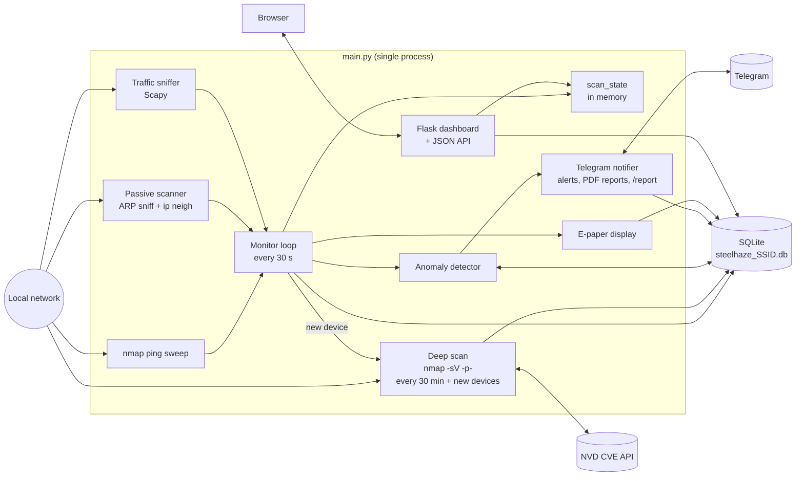

# SteelHaze

A self-hosted network security monitor for the Raspberry Pi. It finds the devices on your home or small-office network, flags new and hidden ones, and checks their open services against known vulnerabilities (CVEs). Results show up on a web dashboard, with optional Telegram alerts.

## What it does

- **Finds devices on your network.** It scans the local network every 30 seconds and also listens passively, so it catches devices that try not to answer scans.
- **Alerts you to new, hidden or vulnerable devices.** You get an alert for an unrecognised device, a device that only shows up passively, a high-severity vulnerability on an open port, or unusually high traffic.
- **Checks devices for known vulnerabilities.** Every 30 minutes, and right away for any new device, it finds open ports and running software and looks them up in the US National Vulnerability Database.
- **Shows everything on a web dashboard.** It lists devices, traffic, alerts, vulnerabilities and 7-day charts. You can mark devices as known and give them names.
- **Sends optional notifications.** It can send Telegram alerts and a PDF report twice a day, and it can show a live summary on a small e-paper screen attached to the Pi.

## Tech stack

- **Language:** Python 3
- **Web:** Flask (dashboard and JSON API), vanilla JavaScript, Chart.js
- **Storage:** SQLite, one database file per network
- **Networking:** nmap (via python-nmap), Scapy, netifaces
- **Integrations:** NVD CVE API 2.0, Telegram Bot API
- **Reporting:** fpdf2, matplotlib
- **Hardware (optional):** Waveshare 2.13" V4 e-paper display over SPI (Pillow)

## Highlights

- **Active and passive discovery work together.** An nmap ping sweep runs alongside a Scapy ARP sniffer and a reader for the kernel's neighbour table (`ip neigh`). Devices that only show up passively are tracked separately and raised as `STEALTH_DEVICE` alerts. A device that stops answering nmap but still sends ARP traffic is downgraded from `nmap` to `passive` instead of being dropped.
- **Each network gets its own database.** The SQLite file is chosen by SSID (`steelhaze_<ssid>.db`) and switches at runtime when the Pi moves to another network. Devices are stored by MAC address, and a `device_network` table links each device to the networks it has been seen on.
- **The CVE scan keeps database locks short.** The deep scan makes all its NVD HTTP requests before it opens a database connection. Old results are removed only for hosts that were found in the current run, so a device that is offline during a scan keeps its CVE history.
- **Optional parts fail safely.** Scapy, Telegram, the e-paper display and the PDF charts each check that their library, config or hardware is available. If it isn't, the code logs it and skips that feature, and the monitor keeps running.

---

## Getting started

### Prerequisites

- Linux. The project is built for Raspberry Pi OS but works on any Linux with a default network route.
- **Root access.** Scapy needs raw sockets for sniffing, and nmap needs root to read MAC addresses.
- Python 3.8 or newer. This is the minimum for Flask 3 and matplotlib 3.7, both listed in `requirements.txt`.
- The `nmap` binary.
- `ip` from iproute2, which reads the ARP cache. It's installed by default on most distributions.
- Optional: `iwgetid` from the wireless-tools package, which reads the Wi-Fi SSID. If it's missing, all data goes into `steelhaze_wired.db`.

### Install

```bash
# System package
sudo apt update && sudo apt install -y nmap

# Code
git clone https://github.com/Eneuss/SteelHaze.git
cd SteelHaze

# Python dependencies in a local virtualenv (venv/ is gitignored)
python3 -m venv venv
venv/bin/pip install -r requirements.txt
```

If you don't want a virtualenv, you can install the dependencies system-wide on Raspberry Pi OS or Debian 12+ instead:

```bash
sudo pip3 install -r requirements.txt --break-system-packages
```

### Run

```bash
sudo venv/bin/python main.py      # or: sudo python3 main.py for a system-wide install
```

Open the dashboard at `http://localhost:5000`, or at `http://<pi-ip>:5000` from another machine on the network. Press Ctrl+C to stop.

On startup the program waits up to 60 seconds for a network connection. It then picks the database for the current SSID and starts the dashboard, the monitor loop and the background threads.

### Configure

There's no general config file. These values are set in the code:

| Setting | Value | Where |
|---|---|---|
| Network scan interval | 30 s | `main.py` (`run_monitor`) |
| Deep CVE scan interval | 30 min | `src/monitor.py` (`deep_scan_loop`) |
| Dashboard address | `0.0.0.0:5000` | `main.py` (`run_web`) |
| High-traffic threshold | 500 MB in 5 min | `src/anomaly_detector.py` |
| Telegram report times | 08:00 and 20:00 | `src/telegram_notify.py` |

#### Telegram (optional)

Telegram is off by default. To turn it on, create `telegram.cfg` in the project root. The file is gitignored.

```ini
[telegram]
token = your_bot_token_here
chat_id = your_chat_id_here
```

1. Message `@BotFather` on Telegram, send `/newbot` and follow the steps to get a token.
2. Send your bot one message, then open `https://api.telegram.org/bot<TOKEN>/getUpdates`. Your chat ID is under `message.chat.id`.

Once it's set up, you get:
- An alert for each `NEW_DEVICE`, `STEALTH_DEVICE` and `CVE_FOUND` (HIGH or CRITICAL) event.
- A text summary and a PDF report at 08:00 and 20:00.
- The same report on demand when you send `/report` to the bot.

If the file is missing or empty, the program runs without Telegram.

#### E-paper display (optional)

This supports a Waveshare 2.13" V4 display over SPI. If the display or its library is missing, the monitor runs as normal without it.

```bash
# Pillow draws the screen image
sudo pip3 install Pillow --break-system-packages

# Enable SPI: raspi-config > Interface Options > SPI

# Waveshare driver library
git clone https://github.com/waveshare/e-Paper.git
cd e-Paper/RaspberryPi_JetsonNano/python && sudo python3 setup.py install
```

If you run SteelHaze from the virtualenv, install Pillow and the Waveshare library with `venv/bin/pip` and `venv/bin/python` instead.

The screen shows the SSID, the subnet, the external IP, device and unknown-device counts, unacknowledged anomalies (24h) and the CVE count. It refreshes at the start and end of each scan cycle.

---

## Architecture

Everything runs in one Python process. `main.py` starts the Flask dashboard and the Telegram threads, then runs the monitor loop on the main thread. The monitor loop starts its own background threads for packet sniffing, the ARP cache and the deep CVE scan. The components share data through the active SQLite database, which runs in WAL mode so the dashboard can read while the monitor writes. They also share a small in-memory module (`scan_state`) that holds the result of the current scan.

Each 30-second cycle does the following:

1. Runs an nmap ping sweep (`-sn`) on the subnet of the default-route interface.
2. Switches the database if the SSID has changed.
3. Saves the devices nmap found, and downgrades devices that only ARP still sees.
4. Saves devices that were seen only passively.
5. Saves a snapshot of the per-IP traffic counters.
6. Starts a CVE scan for each new device.
7. Runs anomaly detection and sends alerts.
8. Updates the e-paper display.



### Anomaly rules

| Type | Trigger | Repeat suppression | Telegram |
|---|---|---|---|
| `NEW_DEVICE` | Unknown device first seen in the last 10 min | 24 h per MAC | Yes |
| `STEALTH_DEVICE` | Device seen only passively for more than 5 min | 24 h per MAC | Yes |
| `HIGH_TRAFFIC` | More than 500 MB recorded for a device in 5 min | 1 h per IP | No |
| `CVE_FOUND` | HIGH or CRITICAL CVE on an open port | 24 h per IP and CVE | Yes |

### CVE lookup

The deep scan runs `nmap -sV -T4 --open -p- --host-timeout 10m` on the subnet and leaves out the Pi's own IP addresses. For each open TCP port, it builds a search keyword from the detected product and version, falling back to the service name. It sends this keyword to the NVD `keywordSearch` endpoint, which gives keyword matches, not exact version matches. It keeps the three most severe results, using CVSS v3.1 when available and v2 otherwise.

### Data model

| Table | Holds |
|---|---|
| `networks` | One row per gateway and subnet, with SSID and interface |
| `devices` | One row per MAC, with an optional user label |
| `device_network` | Links devices to networks: IP, `is_known`, `source` (`nmap` or `passive`) |
| `connection_logs` | One row per device per scan, used for the devices-per-day chart |
| `traffic_stats` | Per-IP byte and packet counter snapshots |
| `anomalies` | Alerts with type, details and an acknowledged flag |
| `open_ports`, `cve_findings` | Results of the last deep scan |

### Dashboard and API

| Page | URL | Shows |
|---|---|---|
| Devices | `/` | Active, offline and passive-only devices; mark as known, set labels |
| Traffic | `/traffic` | Bytes sent and received and packets per device (24h) |
| Anomalies | `/anomalies` | Alerts from the last 24h |
| CVE Findings | `/cves` | Open ports and CVEs per host, linked to NVD |
| Charts | `/timeline` | Devices per day, CVE severity, top traffic, anomalies per day |

The pages fetch their data from JSON endpoints under `/api/`: `devices`, `interfaces`, `stats`, `traffic`, `timeline`, `anomalies`, `ports_and_cves`, `chart/cve_severity`, `chart/anomalies_per_day`. Three POST endpoints change data: `mark_known/<mac>`, `set_label/<mac>`, `acknowledge_anomaly/<id>`. The pages reload their data every 30 seconds. The charts page loads Chart.js from a CDN, so it needs internet access.

---

## Project structure

```
SteelHaze/
├── main.py                  # Entry point: waits for network, starts dashboard, Telegram and monitor loop
├── requirements.txt
├── src/
│   ├── monitor.py           # 30 s monitor loop: saves devices and traffic, triggers scans and alerts
│   ├── scanner.py           # Default interface, subnet, SSID detection; nmap ping sweep
│   ├── passive_scanner.py   # ARP sniffer and kernel ARP cache reader
│   ├── traffic_monitor.py   # Per-IP byte and packet counters (Scapy)
│   ├── nvd_scanner.py       # Deep port and service scan, stores ports and CVEs
│   ├── nvd_lookup.py        # NVD CVE API 2.0 client
│   ├── anomaly_detector.py  # Anomaly rules and repeat suppression
│   ├── database.py          # SQLite schema, per-SSID database switching
│   ├── scan_state.py        # Thread-safe in-memory state of the current scan
│   ├── app.py               # Flask routes and JSON API
│   ├── telegram_notify.py   # Alerts, scheduled reports, /report command
│   ├── report.py            # PDF report (fpdf2 + matplotlib)
│   └── epaper_display.py    # Waveshare 2.13" V4 rendering
├── templates/               # Dashboard pages (Jinja + vanilla JS)
└── static/style.css
```

At runtime the program creates per-network databases (`steelhaze_<ssid>.db`) in the project root. These files and `telegram.cfg` are gitignored.
